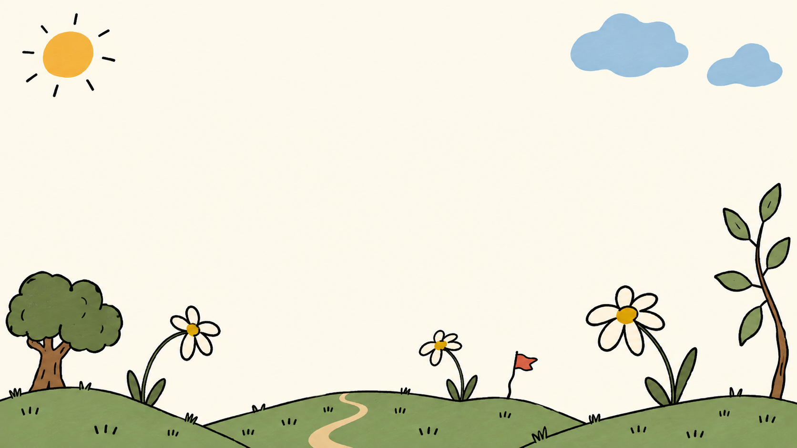

# MathMatch wallpapers

## Current direction: whimsical meadow

`whimsical-meadow.png` is the revised wallpaper: simple wonky hills, oversized flowers, a little path, a crooked flag, sun and clouds. Broad flat colours and loose outlines, a quiet cream centre, no mathematical props or characters. 1672 × 941 RGB PNG. Original generated file preserved without postprocessing.

The earlier `notebook-world.png` is retained as a superseded concept; use the meadow for the revised direction.

## For Devin

Asset-only change. Import statically or copy to `public/wallpapers/` when integrating; `data/` does not expose browser URLs. Preserve aspect ratio, use centred `cover` for full-screen backgrounds, and expect side cropping on phones. Use dark text on this light background and readable panels over decorative edges. Optimize delivery during integration.

## Generation

Generated with OpenAI built-in imagegen; deliberately handmade visual aesthetic. Prompt:

Create a very simple whimsical illustrated landscape wallpaper for an indie game. Wide 16:9 composition. Art direction: a funny little drawing made with a chunky black felt pen and four flat gouache colours, charmingly awkward and intentionally sparse. Warm clean cream background, no aged parchment, no graph grid, no all-over texture. Along ONLY the bottom fifth: three lopsided rolling hills, a tiny meandering footpath, three oversized wonky daisies on long bent stems, one absurdly small crooked red flag. At far left one squat irregular tree shaped like a broccoli floret; far right one tall skinny leaning tree with just five oversized leaves. In upper left a small imperfect orange sun, upper right exactly two lumpy flat pale-blue clouds. Centre and middle upper 65 percent completely clear cream space for game cards. Gentle muted grass green, faded coral red, buttery yellow, pale blue. Broad flat shapes, minimal black pen detail, naive playful illustration, lots of negative space, visually confident and economical. No characters or faces. No mathematics, tools, symbols, numbers, geometry objects, castles, architecture, tokens, keys, books, stars, pennant strings, borders, text or UI. No crosshatching, shading, gradients, elaborate scenery, fine detail, watercolor washes, paper grain, 3D, polish or photorealism. The trees and flowers should feel amusing and individually drawn, not repeated clipart. Strong simple silhouettes, imperfect slightly wobbly outlines. A quiet silly little world, not an epic fantasy map.
