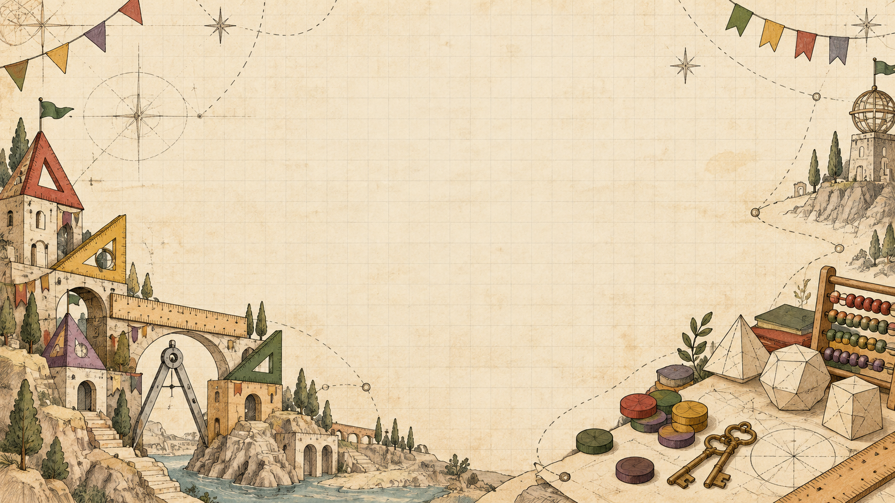

# MathMatch notebook-world wallpaper

A warm whimsical stationery landscape matching the character collection: ruler bridges, set-square roofs, compass arches, folded solids, counting tokens and brass keys. No characters or faces; quiet centre for the card deck.

- File: `notebook-world.png`
- Dimensions: 1672 × 941 pixels (approximately 16:9).
- Format: opaque RGB PNG, 2,719,980 bytes.
- Generated using OpenAI built-in imagegen; handmade sketch aesthetic, not a claim of human authorship.
- Source image preserved without postprocessing.

## For Devin

This is an asset addition only. Import it statically or copy it to `public/wallpapers/` during integration; `data/` paths are not public URLs. Use centred `background-size: cover` and a warm ivory fallback. Narrow screens will crop the decorative edges. Keep proof panels opaque enough for text contrast; adapt the existing dark UI text colours if placing text directly on this light wallpaper. Optimize delivery during integration.

## Generation prompt

Create a landscape 16:9 wallpaper for MathMatch, a whimsical handmade mathematics duelling game. No characters, no faces, no creatures, nothing creepy. Art direction: charming student sketchbook meets handmade board-game map, scratchy imperfect black and sepia pen lines, restrained crosshatching, flat faded watercolor/colored-pencil fills, warm ivory paper texture. Composition: very quiet mostly blank central 55 percent of image for game cards and text, very faint graph-paper grid, decorative scenery concentrated around outer corners and edges. Lower left a small whimsical architectural cluster made of ruler bridges, set-square rooftops, compass archway, with no inhabitants; lower right scattered wooden counting tokens, brass keys, a tiny abacus and paper folded geometric solids. Upper edges sparse curved compass construction arcs, a few stars drawn in pencil, folded paper pennants, delicate sketched paths connect outer scenery. Muted brick red, mustard gold, bottle green and faded purple accents echo existing MathMatch character families; predominately warm light paper. Thoughtfully irregular asymmetry, playful tactile stationery world, intentionally modest drawing rather than overworked fantasy art. Keep mathematical motifs simple, accurate shapes rather than dense random equations. No text, lettering, logo, UI, watermark, giant symbols, scary faces, gradients, glow, glossy 3D or cinematic effects. Full bleed opaque wallpaper, no transparent areas. Clean attractive readable backdrop with sufficient empty space; foreground artwork should not compete with UI. Use wide landscape composition.
